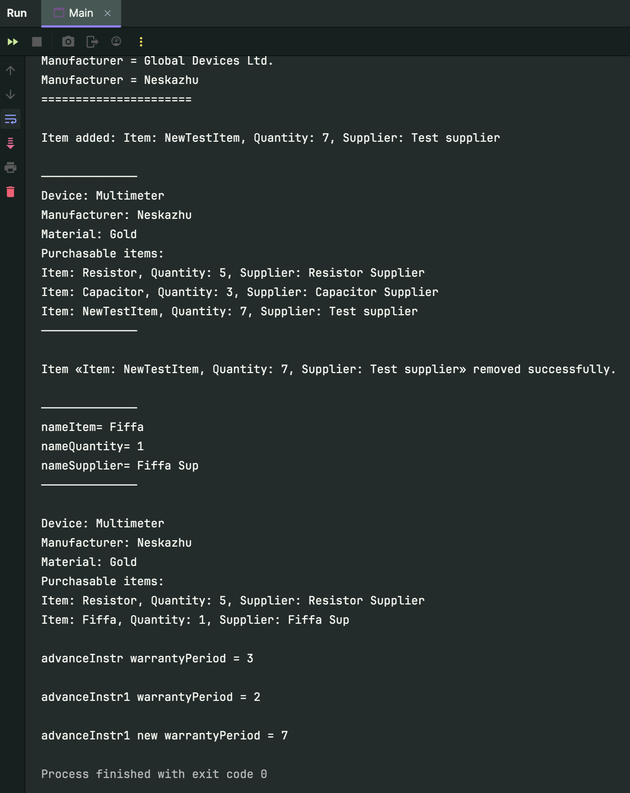

# Лабораторна робота №3 Спадкування у мові Java

## Мета лабораторної роботи –
Придбання навичок використання спадкування, віртуальних функцій, статичних даних і функцій при написанні програм на мові Java.

## Виконання лабораторної роботи
Створити ієрархію з трьох класів (Абстрактний ←Клас1←Клас2).
Характеристики приладу з таблиці 1 реалізуються в перших двох класах. Характеристики приладу з
таблиці 2 реалізуються в класі Класс2.
Визначити, або додати статичні дані та відповідні статичні методи.
Визначити одну або дві віртуальні функції в Абстрактному класі.
Реалізувати віртуальні функції в класі Класс1 і перевизначити в класі Класс2.
Продемонструвати роботу з об'єктами різних класів і використання віртуальних функцій.

### Варіант завдання 1
Характеристики приладів, що реалізуються у варіантах завдань.
Використовуються додаткові характеристики приладу.

1. **1. Найменування приладу.**
2. **5. Гарантійний термін.**
3. **9. Покупні вироби** (деталі та матеріали, які цим заводом не виготовляються, а купуються
   у інших виробників). Для виготовлення кожного приладу може знадобитися кілька покупних
   виробів. Кожен з них характеризується:
   - назвою;
   - кількістю;
   - назвою постачальника.

## Висновок: 
На цій лабораторній роботі, було закріплено навички практичної роботи з класами на мові Java. Придбано навички використання спадкування, віртуальних функцій, статичних даних і функцій при написанні програм на мові Java. У відповідності з завданням стоврено cтворtyj ієрархію з трьох класів (Абстрактний ←Клас1←Клас2).
Характеристики приладу з таблиці 1 реалізуються в перших двох класах. Характеристики приладу з таблиці 2 реалізуються в класі Класс2.
Визначено та додано статичні дані та відповідні статичні методи.
Визначено одну віртуальну функцію displayDeviceInfo в Абстрактному класі.
Реалізувано віртуальну функції в класі Класс1 і перевизначено в класі Класс2.
Продемонструвано роботу з об'єктами різних класів і використання віртуальної функції.


**З таким вмістом в Main:**
```java
import java.util.ArrayList;

public class Main {
    public static void main(String[] args) {

        ArrayList<PurchasableItem> itemsList = new ArrayList<>();
        itemsList.add(new PurchasableItem("Resistor", 5, "Resistor Supplier"));
        itemsList.add(new PurchasableItem("Capacitor",3, "Capacitor Supplier"));

        MeasuringDevice instrument1 = new MeasuringDevice("Multimeter", itemsList);

        AdvancedMeasuringDevice advanceInstr = new AdvancedMeasuringDevice( "Pro", itemsList, 3);
        AdvancedMeasuringDevice advanceInstr1 = new AdvancedMeasuringDevice(2);

        System.out.println("Device 1 info:\n——————————————");
        instrument1.displayDeviceInfo();

        System.out.println("\nDevice advanceInstr info:\n——————————————");
        advanceInstr.displayDeviceInfo();

        System.out.println("\n======================\nMaterial = "+MeasuringDevice.getMaterial());
        MeasuringDevice.setMaterial("Gold");
        System.out.println("Manufacturer = "+AdvancedMeasuringDevice.getManufacturer());
        AdvancedMeasuringDevice.setManufacturer("Neskazhu");
        System.out.println("Manufacturer = "+AbstractDevice.getManufacturer()+"\n======================");

        PurchasableItem newTestItem = new PurchasableItem("NewTestItem", 7, "Test supplier");
        instrument1.addNewItem(newTestItem);

        System.out.println("\n——————————————");
        instrument1.displayDeviceInfo();
        System.out.println("——————————————\n");

        instrument1.removeItem(newTestItem);

        instrument1.items.get(1).setName("Fiffa");
        instrument1.items.get(1).setQuantity(1);
        instrument1.items.get(1).setSupplier("Fiffa Sup");
        System.out.println("\n\n——————————————\nnameItem= "+instrument1.items.get(1).getName());
        System.out.println("nameQuantity= "+instrument1.items.get(1).getQuantity());
        System.out.println("nameSupplier= "+instrument1.items.get(1).getSupplier()+"\n——————————————\n");

        instrument1.displayDeviceInfo();

        System.out.println("\nadvanceInstr warrantyPeriod = "+advanceInstr.getWarrantyPeriod());
        System.out.println("\nadvanceInstr1 warrantyPeriod = "+advanceInstr1.getWarrantyPeriod());
        advanceInstr1.setWarrantyPeriod(7);
        System.out.println("\nadvanceInstr1 new warrantyPeriod = "+advanceInstr1.getWarrantyPeriod());

    }
}

```

**Результат:**


